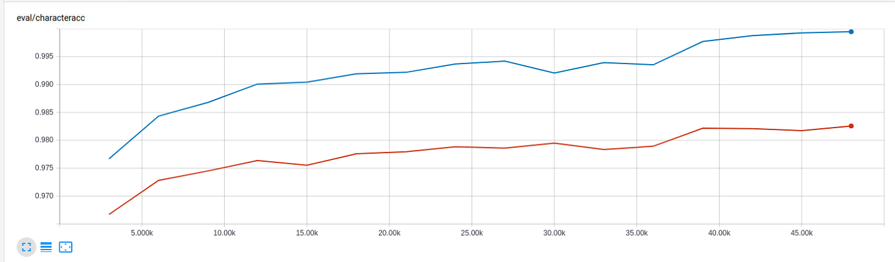
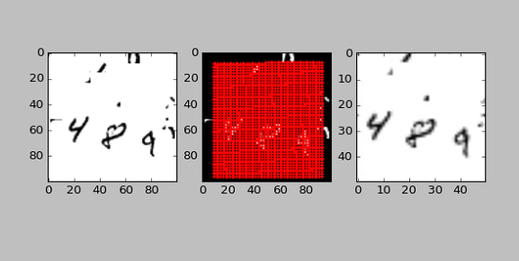
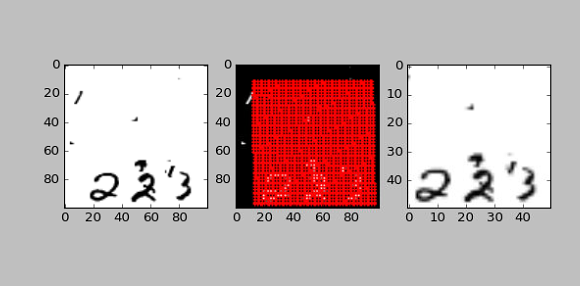
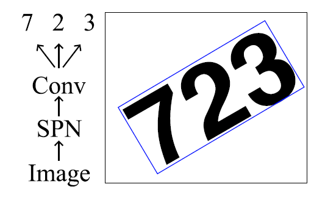
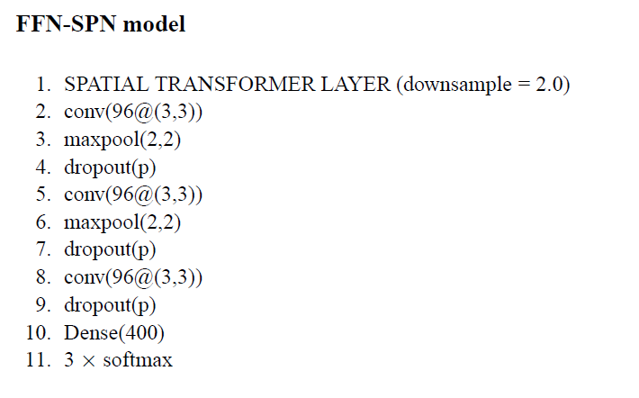

# cluttered_mnist_sequence

## spatial transformer neural network implemented in tensoflow

*Levin Jian, January 2018*


# Overview  

This is my attempt to reproduce the result of the [Recurrent Spatial Transformer Networks paper](https://arxiv.org/abs/1509.05329)  

The awesome author of the paper already kindly publicized the [source codes](https://github.com/skaae/recurrent-spatial-transformer-code), and it's implemented in Theano and Lasagne.  

In this repository, tensorflow and slim are used as the neural network framework, and all the development is done in Python.

In the paper, two models (FFN-SPN model and RNN-SPN model) are implemented and compared. In my tensorflow implementation,  the accuracy of FFN-SPN model already almost achieved the accuracy of RNN-SPN observed in the paper, so I didn't pursue to implement RNN-SPN mode. 

# Final Result

This implementation of FFN-SPN model achieves character accuracy of 98.26%, successfully reproduced the paper result (98%).

Here the training and evaluation accuracy chart.

   


Note that training sample number is 60k and evaluation sample number is 10k


Below are the charts that demonstrate the image transformation  done by spatial transformer sub-network, which is automatically learned by back propagation.

 

 


Note that the left image is the input to spatial transformer network, the red area in the middle image is the source points used to perform affine transformation, and the right image is the output of the spatial transformer network.

# Model Architecture

The FFN-SPN model architecture is quite straightforward, it use spatial transformation network to localize the region of interest and then use convolutional neural network to segment and classify digits.






# Requried library

* Python 3.5
* Tensorflow 1.3

# Instructions for running the scripts

The training took about 1.5 hours on a Nvidia GTX 1080 GPU.

## Get training/eval dataset

1. Download dataset  mnist_sequence3_sample_8distortions_9x9.npz from [here](https://github.com/skaae/recurrent-spatial-transformer-code/blob/master/mnist_sequence3_sample_8distortions_9x9.npz)
2. Save the file to ./data folder (you will have to create this folder first)

## Train the model

	1). Run python ./train_model.py  with below setting
	
	change the `config_training` method in train_model.py as below:

```
def config_training(self):
        TrainModel.config_training(self)
        self.max_number_of_epochs = 60
        return
```


  2). Run python ./train_model.py  with below setting
  
  	change the `config_training` method in train_model.py as below:

```
def config_training(self):
        TrainModel.config_training(self)
        self.max_number_of_epochs = 80
        return
```

## Get both train and evaluation accuracy

Run python ./run_all_checkpoints.py


## Check training result  
in a terminal window, type tensorboard --logdir=./logs/SPNCNNModel


# Possible future work  

Reduce the height size of spatial neural network (like by 1/4, instead of current 1/2), and see if the model can automatically learns well and narrow down the text region.

